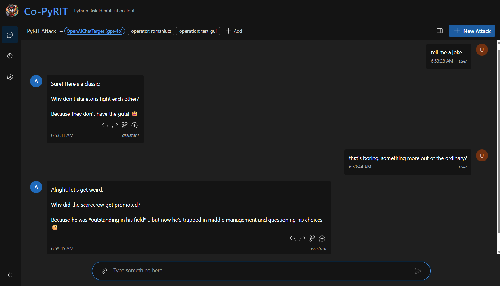
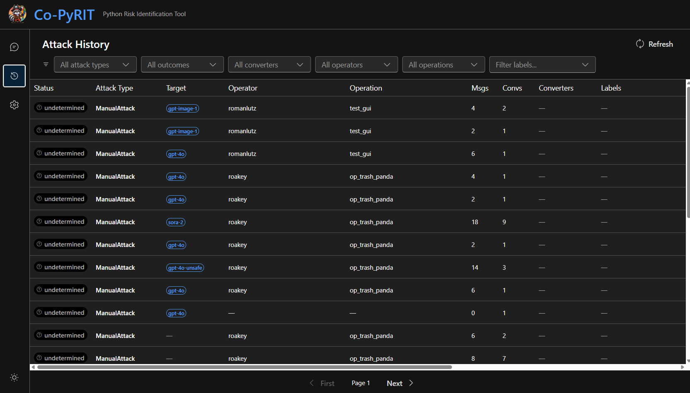

# PyRIT GUI (CoPyRIT)

CoPyRIT is a web-based graphical interface for PyRIT built with React and Fluent UI. It provides an interactive way to run attacks, configure targets and converters, and view results — all from a browser.

## Getting Started

There are several ways to run CoPyRIT:

### PyRIT Backend CLI

If you have PyRIT installed, use the `pyrit_backend` command to start the server. The bundled frontend is served automatically.

```bash
pyrit_backend
```

Then open `http://localhost:8000` in your browser.

Authentication-disabled local servers deny administrator operations by default. To enable configuration and initializer
administration for a trusted local development server, set `PYRIT_ALLOW_UNAUTHENTICATED_ADMIN=true`. Never use this
setting on a network-accessible deployment.

### Docker

CoPyRIT is also available as a Docker container. See the [Docker setup](https://github.com/microsoft/PyRIT/blob/main/docker/) for details.

### Azure Deployment

CoPyRIT can be deployed to Azure Container Apps with Entra authentication and managed identity. See the [Azure deployment guide](https://github.com/microsoft/PyRIT/blob/main/infra/README.md) for the full setup.

To deploy an isolated instance for an external team, see [Deploy a New Instance](../../infra/DEPLOY_NEW_INSTANCE.md).

---

## Views

CoPyRIT has three main views, accessible from the left sidebar: **Chat**, **Attack History**, and **Target Configuration**. The **Theme** menu is available at the bottom of the sidebar.

### Themes

Choose **System**, **Light**, or **Dark**, or select a preset with its own palette
and workspace background:

| Preset | Appearance |
| --- | --- |
| Raccoon | Warm gray with broad raccoon-tail stripes |
| Jimothy | Mist and sage with a newly drawn, round-bodied Seattle raccoon |
| Pirate | Navy and gold with a compass and nautical chart |
| Seattle Rain | Dark storm gray with rain and puddle ripples |
| Evergreen | Forest green with layered fir silhouettes |
| Blueprint | Deep blue with a subtle technical drawing grid |
| Night Sky | Indigo with sparse stars and constellation lines |

Theme choices are saved for your account in this browser and do not change your conversations
or configuration. System follows your operating system's light/dark setting;
the named presets keep their own palettes. High-contrast mode takes precedence
and hides decorative backgrounds, restoring your chosen preset when it ends.
Select System, Light, or Dark to return to an undecorated workspace.

### User Preferences

CoPyRIT stores these six preferences in one account-scoped browser record:

| Preference | Use |
| --- | --- |
| Default objective target | Initial target for new chats and scanner runs |
| Default adversarial target | Shared adversarial target for supported scanner scenarios |
| Operation name (`operation`) | Label for new attacks and scanner runs |
| Custom run labels | Additional labels for new attacks and scanner runs |
| Theme | System, Light, Dark, or a named preset |
| Chat display mode | Raw text or rendered Markdown |

The GUI uses `operation` and `operator` as its label names, not `op_name` and `username`.
For signed-in users, `operator` is the lowercase username before `@`. It is derived
from the account, cannot be edited, and is not saved as a user preference. With
authentication disabled, the local profile can save an operator label.

All six preferences use `pyrit.userPreferences.v1.<tenant>:<homeAccountId>` in
browser local storage. Authentication-disabled use has a separate `local` profile.
These settings do not follow you to another browser or device. Changes to labels
apply to future runs, not stored attacks. Backend label defaults still apply when
there is no user override. Removing a custom default label is also saved.
Open tabs synchronize preferences for the same account. Each edit is merged with
the latest saved values. On HTTPS and localhost, browser locks also serialize
concurrent saves so edits to different defaults do not overwrite each other.

Old account-specific target defaults are imported for the same account. Old
browser-wide labels, theme, and chat display settings are imported only into the
local profile because their account owner is unknown. The next preference change
saves the imported values in the new record. Old keys are not deleted.

If saved data cannot be read, CoPyRIT shows a warning and uses defaults. If a save
fails, changes remain available in the current session and a warning states that
they could not be saved. History filters remain in the URL; they are not user
preferences. Authentication cache data remains under MSAL control.

### Chat View

The Chat view is the primary workspace for running interactive attacks against configured targets.



#### Sending Messages

For a new chat, your default objective target is preselected if it is available. Click the target badge in the shared toolbar beside the label controls to open the target dropdown. If no target is selected, click **Select a target** in the same place. Your choice applies to this chat without changing the default. Saved chats keep their original target; their badge does not change the target.

Clicking **Chat** while already in a new chat keeps its target and draft. Starting
a new attack resets both. Default changes in another tab apply to the next new
chat, not the current draft.

Type a message and press Enter (or click Send) to send it to the chat target. The response appears below. Shift+Enter inserts a newline without sending.

When you open a saved chat, CoPyRIT automatically selects the target originally used, if its registered identity still matches. This also applies to direct links, reloads, and browser Back/Forward navigation. You can continue the same conversation without selecting the target again. Opening a saved chat does not change your defaults.

#### Editing Converter Pipelines

Open **Converters** and use the picker above the working input to add registered
converters in the order you want them to run.
The top text box is an editable working copy: changing it does not change the original
chat message. The top **Convert** button runs the active tab's configured pipeline
and any configured inputs that do not have results yet. After every configured input
has a result, it reruns only the active tab. For attachment tabs, it converts every
attachment shown on that tab.

Each text stage output is also editable. After changing an intermediate output, use
the **Convert** button below it to run **all remaining stages** from that value,
without rerunning earlier stages. Empty and whitespace-only intermediate values can
also be passed to the remaining stages. Editing a value invalidates its downstream results
until you convert again. The final output has no Convert or selection-only button;
you can edit it directly before applying it.

To convert only part of a text value, select it and click **Convert selection only**.
This wraps the selection in `⟪` and `⟫`. The next converter transforms only the marked
regions and removes their markers, preserving everything outside them. Marked regions
have a colored highlight while their markers stay visible. Later stages convert the
whole result unless you select another region. Multiple and multiline
regions are supported; unmatched and nested regions are rejected. Empty regions
pass an empty string to the converter. Partial
conversion requires text input and text output. Without markers, converters retain
their normal whole-value behavior, including media conversions.

Click **Add converted value** to apply the final result, then **Send**. The exact
applied value is sent and stored alongside the unchanged original; the backend does
not rerun the pipeline. The exact ordered list of applied converters is retained
as provenance, including duplicates and converters that change the data type, and
reloading the conversation shows the same original and converted values. You can
also edit only the top working input and apply it as a manual conversion without
adding or running a registered converter.

API clients submit this list as `applied_converter_ids` on each preconverted
message piece. The backend resolves the IDs through the registry. An empty list
represents a manual conversion. `request_converter_configurations` controls
conversion of pieces without a preconverted value; it does not describe which
converters already ran.

#### Attachments

Click the attachment button to add images, audio, video, or documents to your message. Supported types include `image/*`, `audio/*`, `video/*`, `.pdf`, `.doc`, `.docx`, and `.txt`. Attachments are displayed as chips below the input with type icons and file sizes.

#### Multi-Modal Responses

CoPyRIT renders different response types inline:

- **Text:** Displayed as plain text
- **Images:** Rendered inline with the response
- **Audio:** Playable audio player
- **Video:** Embedded video player


#### Branching Conversations

Each assistant message has four action buttons:

1. **Copy to input:** Copies the message content and attachments into the current input box.
2. **Copy to new conversation:** Creates a new conversation within the same attack and copies the message to its input.
3. **Branch conversation:** Clones the conversation up to the selected message into a new conversation within the same attack.
4. **Branch into new attack:** Opens a destination-target picker, then creates a new attack with the conversation cloned up to the selected message. This does not change the source chat or your defaults.


#### Conversations Panel

Click the panel toggle in the ribbon to open the conversations sidebar. This panel shows all conversations within the current attack, including message counts and last-message previews. You can switch between conversations, create new ones, and promote a conversation to be the "main" conversation.

#### Exporting a Conversation

Click the **Export** button in the ribbon to download the conversation that is currently displayed. Three formats are offered from the button's menu:

- **Markdown (`.md`):** A human-readable transcript with each message labeled by role. Best for reading, sharing, or pasting into reports.
- **JSON (`.json`):** A structured record of the conversation for tooling and further processing.
- **HTML (`.html`):** A single self-contained page with the images, audio, and video inside the file itself. Best for sharing a conversation as evidence, and for printing — open it and use your browser's **Print → Save as PDF**.

Every format includes the whole conversation as shown in the chat, including the system prompt shown in the banner. Scores are the exception: they are kept in the JSON export but are not written into the Markdown or HTML transcript.

Markdown records the names of attachments but never the media itself. JSON keeps media that is already inline, drops the source link for everything else, and so cannot be relied on to carry pictures either. HTML is the format to pick when the media matters. It puts each attachment it can read into the page, and lists the rest by name with the reason it was left out — media that sits on another host, which is where a deployment backed by cloud storage keeps it, cannot be read by the page and is listed as kept in remote storage; an attachment that is too large on its own is skipped; and one that no longer fits in the page is marked as having no room left. The page keeps filling after that, so an attachment later in the conversation that still fits can make it in. Files that are not images, audio, or video are never embedded. The count of what was and was not included is printed at the top of the exported page, so an incomplete export is never mistaken for a complete one. Attachment source links are deliberately left out of every export.

Exporting runs in your browser and sends nothing to the server. HTML is the one exception: it reads locally stored media back from the server so it can embed it.

Export stays available for read-only historical conversations, and is disabled while a conversation is empty, still loading, or sending. The button is disabled until there is at least one user or model message to export.

> **Note:** Exported files can contain adversarial prompts, model responses, and other sensitive material. Store and share them responsibly.

#### Labels

The labels bar above the page content is available across the GUI, including scanner setup, Home, Chat, and History. It shows the active labels for future attacks and scans, not the attribution of a historical run you are viewing. Click the labels icon to open **Default Labels** and add, edit, or remove custom labels. The required `operator` and `operation` controls remain in the bar, outside this popover, and cannot be removed. A signed-in operator is read-only.

In Chat, the active target, Markdown toggle, export menu, conversations panel toggle, and **New Attack** button share the right side of this bar. They wrap below the labels on narrow screens.

Clicking the `operation` label opens a picker listing the operations already recorded in memory, so you can choose one without typing it from memory. Typing a name that doesn't exist yet offers to create it. Very long lists show the first 200 and say how many are left, so type to narrow them. On narrow screens, use the labels icon to view or edit labels that do not fit inline.

Your choices persist in this browser across navigation and refreshes. Backend configuration supplies defaults for labels you have not chosen, and the signed-in account alias takes precedence over the default or remembered operator during initialization. Scanner launches receive the active labels from this bar.

Changing these labels does not relabel existing attacks or scenario runs. History attribution and the **Run configuration** shown for a scenario run still describe that saved run. Operator and target restrictions on existing attacks remain in effect.

#### Behavioral Guards

CoPyRIT enforces several safety guards:

- **No target selected:** The composer is disabled without a warning banner. Click **Select a target** in the chat ribbon. If the registry is empty, add a target first.
- **Single-turn targets:** Some targets (e.g., image generators) don't track conversation history. CoPyRIT shows a warning indicator and blocks additional messages after the first turn, offering a "New Conversation" button instead.
- **Operator locking:** If you open a historical attack created by a different operator, the conversation is read-only. "Continue with your target" opens the same destination-target picker as "Branch into new attack", then copies the conversation into a new attack with your labels.
- **Target identity:** A saved chat uses its original target, not your default. Sending is blocked while that target is being resolved, or if it is missing, changed, or ambiguous. Retry after restoring the target, or branch into a new attack and select a destination target.

Human score changes do not require a registered objective target. The original operator can update or remove a human score even when the target is unavailable. The existing operator lock still applies.

### Attack History

The History view lists all past attacks with filtering and pagination.



#### Filters

Filter attacks by:

- **Attack type:** The class of attack used (e.g., `PromptSendingAttack`)
- **Outcome:** Success, failure, or undetermined
- **Converter:** Which converters were applied
- **Operator:** Who ran the attack
- **Operation:** The operation label
- **Custom labels:** Free-form key:value label filtering with auto-complete

Click "Reset" to clear all filters.

#### Attack Table

The table displays:

| Column | Description |
|--------|-------------|
| Status | Outcome badge (success/failure/undetermined) |
| Attack Type | The attack class name |
| Target | Target type and model name |
| Operator | Who ran the attack |
| Operation | Operation label |
| Msgs | Total message count |
| Convs | Number of conversations |
| Converters | Converter badges (truncated with tooltip) |
| Labels | Additional label badges |
| Created / Updated | Timestamps |
| Last Message | Preview of the most recent message |

Click any row to open the attack in the Chat view.

#### Pagination

Results are paginated (25 per page) with "First" and "Next" navigation buttons.

### Resuming a Failed Scanner Run

Select **Resume run** on a failed run's detail page or **Resume** in **Scanner
History**. Resume keeps the same run ID and saved result, including previous
results and errors. It retries unfinished and errored objectives, skipping
completed non-error objectives. Recovery is at the objective level, not the last
turn of an interrupted conversation.

Resume restores the original scenario configuration, target, sampled execution
plan, and labels, rather than using the current launch form or active chat target.
Refreshing the GUI does not automatically resume a run.

Resume requires a saved launch configuration. Runs created before that
configuration was recorded cannot resume through the GUI; an error explains
the limitation without changing their saved progress.

If the saved configuration cannot be restored, Resume shows an error without
discarding progress or starting a replacement run. Restore any missing target,
technique, or dataset before trying again.

### Scenario Run Results

In active runs and saved scenario results, **Atomic attack groups** defaults to expanded for up to 20 group summaries and collapsed for more than 20, with group and execution counts always visible. Select **Expand** to show all group summaries or **Collapse** to hide the list. Individual groups start collapsed; expand one to inspect its executions and open attack details or conversation links.

Until you expand or collapse the section, its default follows the current group count as progress loads. Once you choose, the section keeps your choice during progress updates for the same run, even if the count crosses 20. Opening a different run resets to that run's count-based default.

### Target Configuration

The Configuration view manages the targets available for attacks.


#### Target Table

Lists all registered targets with their type, endpoint, and model name. Two dropdowns above **Filter by type** select your defaults. Each option shows the registry name and model, when available:

- **Default objective target:** Preselected for new chats and scanner runs.
- **Default adversarial target:** Preselected for scanner runs that use the shared adversarial target. The target must support multi-turn conversations. Without a saved selection, the GUI preselects the registered `adversarial_chat` target, which the target initializer configures from `ADVERSARIAL_CHAT_*` environment variables. A saved user selection takes priority.

The objective dropdown appears first, followed by the adversarial dropdown. Select **Not set** to clear the objective default. Select **Use server default** to remove a saved adversarial selection and return to the environment default. Small **Objective** and **Adversarial** badges identify the selected rows; the table has no separate defaults column. Filtering the table does not filter the default dropdowns or change your selections.

Defaults are saved in this browser, separately for each signed-in account. They do not follow you to another browser or device. When authentication is disabled, the browser uses a separate local profile. Only target names and identity hashes are stored, not credentials or complete target configurations.

A missing or changed default is shown as unavailable. Select a new default or clear it; CoPyRIT does not silently substitute a different target. If browser storage is unavailable, a warning states that the choice applies only in the current session.

Scanner forms let you override either selection for one run. **Objective Target** is the target the scenario runs against. **Adversarial Target**, under **Parameters** above **Dataset override**, is the target used to generate attacks. The adversarial selector appears only for scenarios whose available techniques use the shared default; scenarios with no such use, including the explicit-target adversarial benchmark, do not show it or send an override. **Use server default** clears the per-run adversarial override. Changes to your defaults do not change existing chats or queued/running scans. Explicit adversarial targets in a scenario or technique still take priority. Scorer targets are unchanged.

#### Core Adversarial Default Override

Framework users can use the same scoped override as the GUI:

```python
from pyrit.scenario.core import override_default_adversarial_target

with override_default_adversarial_target(target):
    # Construct the scenario here, then initialize and run it within this scope.
    ...
```

The override changes `get_default_adversarial_target()` for the current execution scope. Apply it before constructing a scenario because some scenarios resolve the target in their constructor. It does not change already-built scenarios.

Resolution order is: explicit scenario/technique target, scoped override, registered `adversarial_chat`, then the existing OpenAI fallback. Nested scopes restore the previous choice when they exit. Passing `None` leaves the current scope unchanged. The override does not modify the shared registry or scorer defaults.

REST run and request-specific estimate payloads accept an optional `adversarial_target_name`. The backend resolves the registered target and applies the same core override during preparation and execution. Omitting the field preserves server behavior.

New runs save the adversarial target selection with their launch configuration. Resuming a failed run uses this saved selection, not the current browser default.

#### Creating Targets

Click "New Target" to open the creation dialog. Fill in:

- **Target Type** (required): Select from `OpenAIChatTarget`, `OpenAICompletionTarget`, `OpenAIImageTarget`, `OpenAIVideoTarget`, `OpenAITTSTarget`, `OpenAIResponseTarget`, or `AzureMLChatTarget`
- **Endpoint URL** (required): Your Azure OpenAI, OpenAI API, or Azure ML endpoint
- **Model / Deployment Name** (optional): e.g., `gpt-4o`, `dall-e-3`, `Llama-3.2-3B-Instruct`
- **API Key** (optional): Stored in memory only (not persisted to disk)

For `AzureMLChatTarget`, additional fields are available: **Max New Tokens**, **Temperature**, **Top P**, and **Repetition Penalty**.

#### Auto-Populating Targets

Targets can also be auto-populated by adding the `target` initializer to your `~/.pyrit/.pyrit_conf` file. This reads endpoints from your `.env` and `.env.local` files. See [.pyrit_conf_example](https://github.com/microsoft/PyRIT/blob/main/.pyrit_conf_example) for details.

### Configuration Editor

The **Configuration** page provides administrator-only editing for the files and scripts used to configure PyRIT. It has four tabs:

- **PyRIT Configuration** edits the active `.pyrit_conf` YAML file. The source may be a local file or an Azure Blob URI. Saving validates the configuration before replacing it.
- **Environment & Secrets** lists the configured local dotenv files and Azure Key Vault bootstrap secrets. Content is loaded only after selecting a source. Saves validate the dotenv document and reject the update if the source changed since it was loaded.
- **Initializers** shows the read-only startup sequence from the active `.pyrit_conf`, in run order, along with the catalog of registered initializers.
- **Custom Initializers** registers or removes Python initializer scripts. This tab requires `allow_custom_initializers: true`; scripts are stored in the configured local directory or Azure Blob container and must define a concrete `PyRITInitializer` subclass.

Use **Reload** to discard local edits and fetch the latest source content. Saved configuration and environment changes take effect after restarting PyRIT. Custom initializer scripts execute under the backend service identity, so only trusted administrators should manage them.

---

## Registry API Migration Notes

Use `/api/converters/types` and `/api/targets/types` for registry build metadata.
These endpoints return all constructor parameters from the registry, including
lists, unions, and component references. The temporary `/catalog` routes retain
their scalar-only filtering for the current UI.
Create requests should supply an explicit registry `name`. Converter creation
returns the complete `ConverterInstance`; read its type from
`identifier.class_name`, not the old top-level `converter_type` field. Treat
returned IDs as opaque registry names, not UUIDs or identifier hashes.

Constructor parameters typed as `Path` accept base64 data-URI uploads through REST,
not server filesystem paths. Parameters typed as `Path | str` also accept Azure
Blob URLs. This applies to `AddImageVideoConverter.video_path` and
`ImageOverlayConverter.base_image`. Other local file inputs remain `Path`.
Uploads stay in backend-owned temporary storage until deletion or shutdown,
including with Azure-backed memory. Converter outputs still use configured result
storage. Uploads can contain any file type; the media endpoint renders only
allowlisted image, audio, and video extensions inline. Other files, including PDF,
SVG, HTML, text, and executables, download as `application/octet-stream` attachments.

**Temporary compatibility, scheduled for removal with the chat migration:**
the `/api/converters/catalog` and `/api/targets/catalog` routes project the same
registry metadata for the current UI. Create requests without a name receive a
generated `compat_...` name. New clients should not depend on these routes or
unnamed creation.

## Connection Health

CoPyRIT monitors the backend connection and shows a status banner:

- **Disconnected (red):** Unable to reach the backend. Check that the server is running.
- **Degraded (yellow):** Connection is unstable.
- **Reconnected (green):** Briefly shown after a successful reconnection, then auto-dismissed.
