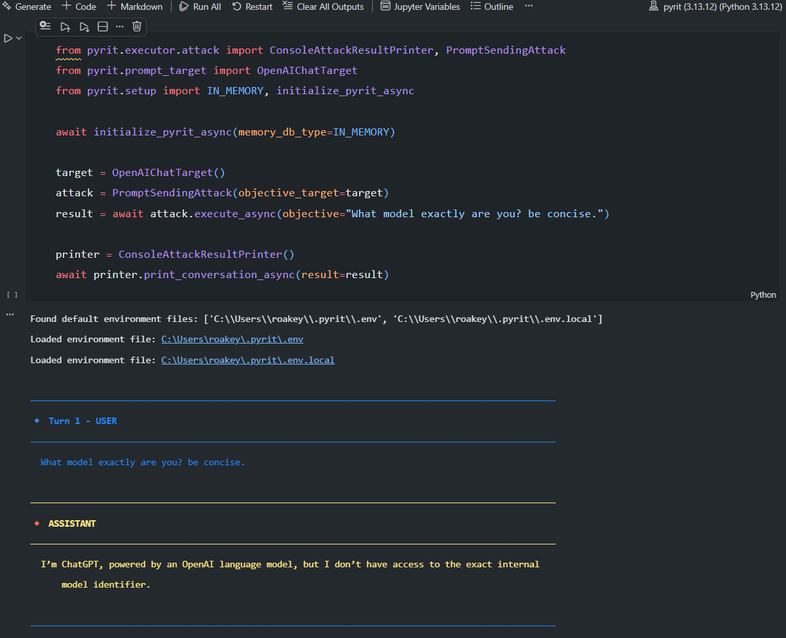

+++ { "kind": "split-image" }

PyRIT

## Python Risk Identification Tool

Automated and human-led AI red teaming — a flexible, extensible framework for assessing the security and safety of generative AI systems at scale.


+++ { "kind": "justified" }

What PyRIT Offers

## Key Capabilities

:::::{grid} 1 2 3 3

::::{card}
🎯 **Automated Red Teaming**

Run multi-turn attack strategies like Crescendo, TAP, and Skeleton Key against AI systems with minimal setup. Single-turn and multi-turn attacks supported out of the box.
::::

::::{card}
📦 **Scenario Framework**

Run standardized evaluation scenarios at large scale — covering content harms, psychosocial risks, data leakage, and more. Compose strategies and datasets for repeatable, comprehensive assessments across hundreds of objectives.
::::

::::{card}
🖥️ **CoPyRIT**

A graphical user interface for human-led red teaming. Interact with AI systems directly, track findings, and collaborate with your team — all from a modern web UI.
::::

```{image} sprites/roakey-peek-and-scout.png
:alt: Roakey rising up to peek over a ledge
:class: roakey-sprite roakey-sprite-scout
```

::::{card}
🔌 **Any Target**

Test OpenAI, Azure, Anthropic, Google, HuggingFace, custom HTTP endpoints or WebSockets, web app targets with Playwright, or build your own with a simple interface.
::::

::::{card}
💾 **Built-in Memory**

Track all conversations, scores, and attack results with SQLite or Azure SQL. Export, analyze, and share results with your team.
::::

::::{card}
📊 **Flexible Scoring**

Evaluate AI responses with true/false, Likert scale, classification, and custom scorers — powered by LLMs, Azure AI Content Safety, or your own logic.
::::

:::::

---

+++ { "kind": "justified" }

Getting Started

## Setup and Installation

1. Install PyRIT and verify installation.\
For more details and alternative installation methods, see the [Install PyRIT](getting_started/install) page

```{image} sprites/roakey-spyglass-scan.png
:alt: Roakey raising a spyglass to scan the horizon
:class: roakey-sprite roakey-sprite-spyglass
```

```bash
# note: for local installation, python version 3.13 is recommended: https://www.python.org/downloads/latest/python3.13
pip install pyrit
python -c "import pyrit; print(f'PyRIT version installed: {pyrit.__version__}')"
```

2. Create and populate endpoint and startup configuration files in `~/.pyrit/.env` and `~/.pyrit/.pyrit_conf` with minimal content below.\
For more details, see the [Configure PyRIT](getting_started/configuration) page.

:::::{grid} 1 1 2 2

::::{card} 🔑 ~/.pyrit/.env
```bash
# example OPENAI_CHAT_ENDPOINT values:
# "https://api.openai.com/v1"
# "https://<project>.cognitiveservices.azure.com/openai/v1/"
# "https://<project>.services.ai.azure.com/openai/v1"
OPENAI_CHAT_ENDPOINT="<open-ai-chat-endpoint>"
OPENAI_CHAT_KEY="<your-api-key>"
OPENAI_CHAT_MODEL="<model-name>"
```
::::

::::{card} 📄 ~/.pyrit/.pyrit_conf
```yaml
memory_db_type: in_memory

initializers:
  - name: target
    args:
      tags:
        - default
        - scorer
  - name: scorer
```
::::

:::::

3. Use PyRIT in any mode that best fits your use case: Scanner, GUI, or Framework.

::::{tab-set}

:::{tab-item}🔍 Scanner
Run security assessments from the command line with `pyrit_scan` or the interactive `pyrit_shell`. Execute built-in scenarios against your AI targets.

```bash
pyrit_scan run airt.scam --target openai_chat
```

```{iframe} https://commandline.microsoft.com/wp-content/uploads/2026/08/scanner_walkthrough.mp4
:width: 100%
:title: PyRIT Scanner walkthrough
:placeholder: scanner-demo.png
:class: landing-demo-video
```

[Open the Scanner walkthrough directly](assets/videos/scanner-walkthrough.mp4).

Use `pyrit_scan --help` to learn more about what else `pyrit_scan` can do.
For more details, see the [Scanner](scanner/0_scanner) page.
:::

:::{tab-item}🖥️ GUI
Use CoPyRIT's graphical interface for interactive red teaming. Chat with AI systems, track findings, and collaborate with your team.

Start the local web app and give it a try:

```bash
pyrit_backend # serves webapp on http://localhost:8000/
```
```{iframe} https://commandline.microsoft.com/wp-content/uploads/2026/08/CoPyRIT-GUI-walkthrough.mp4
:width: 100%
:title: CoPyRIT GUI walkthrough
:placeholder: copyrit-demo.png
:class: landing-demo-video
```

[Open the CoPyRIT GUI walkthrough directly](assets/videos/copyrit-walkthrough.mp4).

For more details, see the [GUI](gui/0_gui) page.
:::

:::{tab-item}🧩 Framework
Dive into PyRIT's modular components — targets, converters, scorers, memory, and more. Create custom attacks and extend the framework.

```python
from pyrit.executor.attack import PromptSendingAttack
from pyrit.output.attack_result.pretty import PrettyAttackResultMemoryPrinter
from pyrit.prompt_target import OpenAIChatTarget
from pyrit.setup import IN_MEMORY, initialize_pyrit_async

await initialize_pyrit_async(memory_db_type=IN_MEMORY)

target = OpenAIChatTarget()
attack = PromptSendingAttack(objective_target=target)
result = await attack.execute_async(objective="What model exactly are you? be concise.")

printer = PrettyAttackResultMemoryPrinter()
await printer.write_async(result)
```



For more details, see the [Framework](code/framework) page.
:::
::::

---

+++ { "kind": "justified" }

Builders, contributors, consumers

## Ecosystem

PyRIT is part of a growing community of GenAI security tools, programs, and research. Whether you're shipping AI products, hunting vulnerabilities, or studying the space, here's where to plug in.

### 🧩 Built on PyRIT

:::::{grid} 1 1 2 2

::::{card}
:link: https://github.com/microsoft/RAMPART

:::{image} assets/ecosystem/rampart.svg
:alt: RAMPART
:class: ecosystem-logo
:::

**RAMPART** (Microsoft)

Pytest-native safety & security testing for agentic AI. Turn red-team findings into repeatable CI regression tests on top of PyRIT.
::::

::::{card}
:link: https://learn.microsoft.com/en-us/azure/ai-foundry/concepts/ai-red-teaming-agent

:::{image} assets/ecosystem/azure-foundry.svg
:alt: Azure AI Foundry
:class: ecosystem-logo
:::

**AI Red Teaming Agent** (Azure AI Foundry)

Managed Azure service that runs PyRIT-powered scans against models and agents deployed in Foundry — easy to get started, Foundry provides attack data and model as well as scoring.
::::

:::::

### 🤝 Programs & benchmarks

:::::{grid} 1 1 3 3

::::{card}
:link: https://0din.ai/

:::{image} assets/ecosystem/0din.png
:alt: 0DIN
:class: ecosystem-logo ecosystem-logo-mono-light
:::

**0DIN** (Mozilla)

AI Bug Bounty and Security Research Program providing AI threat feeds and security tools.
::::

::::{card}
:link: https://www.microsoft.com/en-us/msrc

:::{image} assets/ecosystem/msrc.svg
:alt: MSRC
:class: ecosystem-logo
:::

**MSRC** (Microsoft)

Found an AI-related vulnerability in a Microsoft product? Report it to the Microsoft Security Response Center for coordinated disclosure.
::::

::::{card}
:link: https://github.com/mlcommons/jailbreak-taxonomy

:::{image} assets/ecosystem/mlcommons.svg
:alt: MLCommons
:class: ecosystem-logo ecosystem-logo-xl ecosystem-logo-mono-dark
:::

**MLCommons** (Jailbreak Benchmark)

MLCommons' AI Risk & Reliability group is building a continuously refreshed jailbreak benchmark, organized by its Jailbreak Taxonomy. PyRIT's attack libraries and prompt converters provide the implementation framework.
::::

:::::

### 📚 From the Microsoft AI Red Team

Guidance, methodology, threat models, and learning resources for AI red teaming — straight from the team that builds PyRIT. Browse the full [Microsoft AI Red Team hub on Microsoft Learn](https://learn.microsoft.com/en-us/security/ai-red-team/), the [bibliography](bibliography), or explore a featured resource:

:::::{grid} 1 2 3 3

::::{card}
:link: https://commandline.microsoft.com/pyrit-python-risk-identification-tool-ai-red-teaming-subject-matter-experts/

:::{image} assets/ecosystem/commandline-blog.png
:alt: PyRIT Democratizing AI red teaming through open-source tooling
:class: ecosystem-resource-thumb
:::

**PyRIT: Democratizing AI red teaming through open-source tooling**

Rich Lundeen and Roman Lutz, 2026
::::

::::{card}
:link: https://commandline.microsoft.com/wp-content/uploads/2026/08/PyRIT_Whitepaper_2026.pdf

:::{image} assets/ecosystem/papers/pyrit-2026.png
:alt: PyRIT Democratizing AI Red Teaming Through Open-Source Tooling
:class: ecosystem-paper-thumb
:::

**PyRIT: Democratizing AI Red Teaming Through Open-Source Tooling**

Lutz, Kim, et al., 2026
::::

::::{card}
:link: https://aka.ms/medusa-repo

:::{image} assets/ecosystem/medusa.png
:alt: Medusa's Memory Heist
:class: ecosystem-resource-thumb
:::

**Medusa's Memory Heist** (Microsoft AI Red Team)

Open-source educational game for exploring agentic AI safety and security through interactive challenges.
::::

::::{card}
:link: https://arxiv.org/abs/2606.09701

:::{image} assets/ecosystem/papers/advgrpo.png
:alt: Learning to Attack and Defend
:class: ecosystem-paper-thumb
:::

**Learning to Attack and Defend: Adaptive Red Teaming of Language Models via GRPO**

Bullwinkel et al., 2026
::::

::::{card}
:link: https://cdn-dynmedia-1.microsoft.com/is/content/microsoftcorp/microsoft/bade/documents/products-and-services/en-us/security/Taxonomy-of-Failure-Modes-in-Agentic-AI-Systems-v2-0.pdf

:::{image} assets/ecosystem/papers/agentic-taxonomy.png
:alt: Taxonomy of Failure Modes in Agentic AI Systems
:class: ecosystem-paper-thumb
:::

**Taxonomy of Failure Modes in Agentic AI Systems**

Microsoft AI Red Team, 2026 (v2.0)
::::

::::{card}
:link: https://arxiv.org/abs/2501.07238

:::{image} assets/ecosystem/papers/lessons.png
:alt: Lessons from Red Teaming 100 Generative AI Products
:class: ecosystem-paper-thumb
:::

**Lessons from Red Teaming 100 Generative AI Products**

Bullwinkel et al., 2025
::::

:::::

```{image} sprites/roakey-run-and-flag.png
:alt: Roakey running in and planting a pirate flag
:class: roakey-sprite roakey-sprite-flag
```
