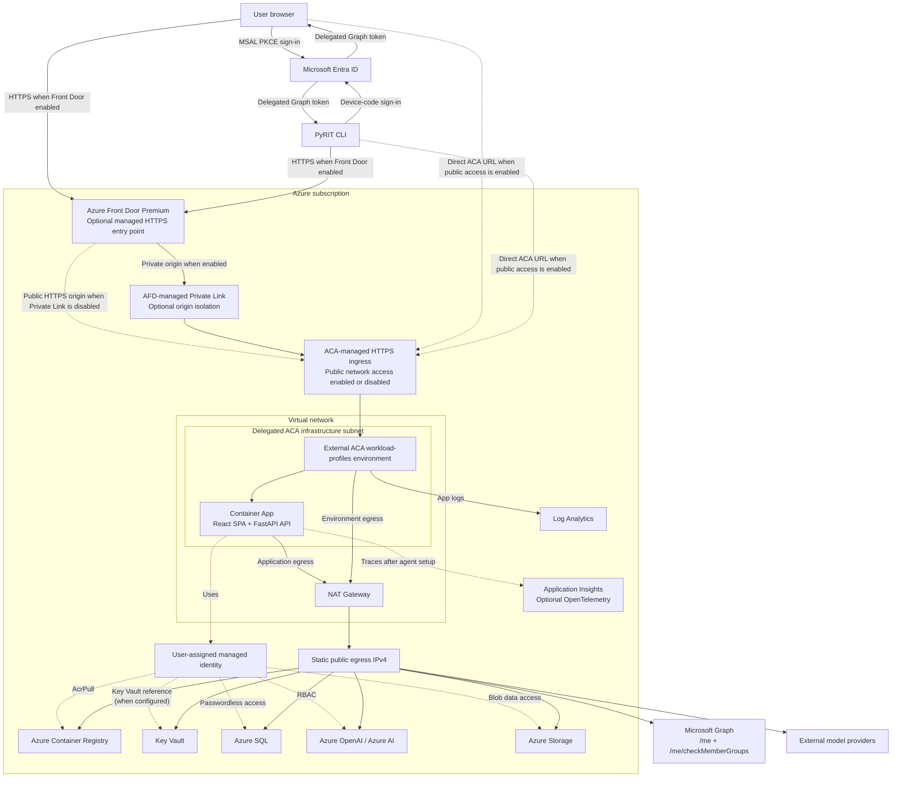

# CoPyRIT GUI — Azure Deployment

Deploy the CoPyRIT GUI as an Azure Container App with [MSAL](https://learn.microsoft.com/en-us/entra/msal/) PKCE authentication, managed identity, security response headers, and no secrets embedded in source or container images.

## Architecture



The base topology is public ACA-managed HTTPS ingress plus VNet-integrated fixed NAT egress. `enableFrontDoor=true` adds Front Door Premium as the preferred managed HTTPS URL. By default, the ACA origin remains concurrently public and can bypass Front Door. `enableFrontDoorPrivateLink=true` instead connects Premium Front Door to the ACA environment through Private Link; setting `disableContainerAppsPublicAccess=true` then removes the direct public ACA path. Bicep rejects public-access shutdown unless both Front Door and its Private Link origin are enabled. The team ADO workflow uses this isolated-origin mode; community examples leave all three Front Door settings disabled. Front Door mode requires `allowedCidr` to be empty because ACA sees Front Door rather than the original client. Front Door changes inbound routing only: outbound connections from ACA continue to use the NAT Gateway's static IPv4.

## Development Workflow

### Local development

```bash
cd frontend
npm install   # one-time: install frontend dependencies
npm start     # starts both backend (port 8000) and frontend (port 3000)
```

`npm start` runs `dev.py`, which launches the FastAPI backend and Vite dev server together, waits for the health check, and prints URLs when ready. Press Ctrl+C to stop both.

When `ENTRA_TENANT_ID`, `ENTRA_CLIENT_ID`, and `ENTRA_ALLOWED_GROUP_IDS` are all unset, auth is disabled and all requests are allowed. Setting only a subset is a startup configuration error. Swagger UI is available at `http://localhost:8000/docs`.

> ⚠️ Auth-disabled mode is for **local development only**. Never deploy to a network-accessible environment without all three authentication settings.

### Deployment workflows

```
Local dev → Build and push image → Preview Bicep changes → Deploy → Complete post-deployment steps
```

Community users can deploy `main.bicep` directly using the instructions below. For a fully provisioned isolated instance, use `deploy_instance.py` and [DEPLOY_NEW_INSTANCE.md](DEPLOY_NEW_INSTANCE.md). `gui-deploy.yml` is the Microsoft team's internal Azure DevOps workflow; it depends on team-owned ADO configuration and is not the community deployment interface.

`deploy_instance.py` uses the default `enableFrontDoor=false` path. Use direct Bicep when a community deployment needs Front Door. The script still automates resource creation, Entra setup, inline secrets, and selected RBAC, but its documented SQL and provider post-deployment steps remain required.

## Security

- **Authentication**: [MSAL](https://learn.microsoft.com/en-us/entra/msal/) [PKCE](https://oauth.net/2/pkce/) on the frontend (`@azure/msal-browser`) and public-client device-code authentication for the PyRIT CLI, backed by Microsoft Graph middleware on the backend. Both clients send delegated Graph tokens, and the backend authenticates them through Graph `/me`. These public-client flows require no client secrets or certificates.
- **Authorization**: Entra group checks use `allowedGroupObjectIds` for application access and `adminGroupObjectId` for backend configuration routes. Requires delegated Graph `User.Read`; the backend calls `/me/checkMemberGroups` and compares the returned transitive memberships with the configured group IDs. Each security group must also be assigned to the enterprise app (see Prerequisites §3). Authenticated deployments require at least one allowed group and fail to start without one. `/api/health`, `/api/auth/config`, and `/api/media` are intentional public exceptions; other `/api` routes require authentication when auth is enabled. Successful identity and membership results are cached in-process for 60 seconds, keyed by a SHA-256 token digest, to reduce Graph latency and throttling. Bearer tokens themselves are not stored in the cache.
- **Identity**: `deploy_instance.py` creates its user-assigned managed identity (UAMI) and grants AcrPull and Storage Blob Data Contributor before deploying Bicep. A direct Bicep deployment can create `<appName>-identity`, but the template creates no role assignments, so its first revision can remain unhealthy until required roles are granted and the revision is restarted. A healthy one-pass direct deployment uses an existing, pre-authorized UAMI. `AZURE_CLIENT_ID` is set to the UAMI's client ID so `DefaultAzureCredential` selects the correct identity.
- **Network**: The template always creates a VNet-integrated external Container Apps environment, one delegated ACA infrastructure subnet, a Standard NAT Gateway, and a static outbound IPv4. ACA supplies the generated HTTPS hostname and trusted certificate. In direct-ACA mode, `allowedCidr` optionally restricts public ingress to one IPv4 CIDR; an empty value permits public ingress. Front Door mode requires `allowedCidr` to be empty because ACA sees Front Door backend addresses, not the original client; Bicep and the team pipeline reject the invalid combination. Entra sign-in, enterprise-app assignment, and backend group checks remain mandatory application access controls.
- **Front Door**: `enableFrontDoor=true` creates a Premium profile, managed `azurefd.net` endpoint, HTTPS ACA origin, `/api/health` probe, uncached catch-all route, and 240-second origin response timeout matching the ACA HTTP ingress limit. `enableFrontDoorPrivateLink=true` targets the ACA managed environment with group ID `managedEnvironments`. The resulting private endpoint connection must be approved before AFD can route privately. `disableContainerAppsPublicAccess=true` disables the ACA environment public endpoint and CORS then permits only the AFD origin. The module does not create a WAF policy; application authentication and authorization remain mandatory.
- **Routing**: Inbound requests through Front Door do not traverse the NAT Gateway. When ACA public access remains enabled, users can also reach ACA directly. When Private Link is enabled and public access is disabled, all public application traffic enters through Front Door. Outbound connections from the ACA environment that leave the virtual network use the NAT Gateway's static public IPv4.
- **Response headers**: `SecurityHeadersMiddleware` adds [CSP](https://developer.mozilla.org/en-US/docs/Web/HTTP/CSP), HTTP Strict Transport Security (HSTS, production only), X-Frame-Options, X-Content-Type-Options, Referrer-Policy, Permissions-Policy, and Cache-Control (`no-store` on API routes). Swagger/OpenAPI disabled in production.
- **Data**: Azure SQL with managed identity authentication (no passwords)
- **Secrets**: When `envFileContents` is nonempty, Bicep stores it as an inline ACA secret. Otherwise, PyRIT reads and updates `envSecretName` directly through the app UAMI; that path requires `Key Vault Secrets Officer` and network access to the vault. `deploy_instance.py` uses the inline path.
- **Images**: Direct Bicep deployments must supply a unique tag or digest; the template does not reject `:latest`.
- **Supply chain**: [ACR](https://learn.microsoft.com/en-us/azure/container-registry/) pull uses managed identity RBAC. `deploy_instance.py` grants AcrPull, while direct Bicep callers manage it themselves. `frontend/.npmrc` pins the npm registry. `docker/Dockerfile` declares `ARG BASE_IMAGE` with no default — all callers pass it explicitly to avoid container supply chain security scanner warnings.
- **Tags**: Bicep applies the supplied `tags` object to every resource it creates; the default object includes Service/Owner/DataClass governance tags.
- **Logging**: Log Analytics (app logs) + optional [OTel](https://opentelemetry.io/) via Application Insights

## Prerequisites

> **Before you begin**: Run `az login` and confirm your subscription with `az account show`. You need permissions to create Entra app registrations, security groups, and Azure resource deployments.

The Bicep template creates the Container Apps resources, dedicated network, NAT Gateway, static egress IP, and (unless supplied) Log Analytics workspace. It can also declare an ACR and UAMI, but it does not push an image or create RBAC role assignments. The supported one-pass workflows therefore use an existing ACR; a healthy one-pass direct Bicep deployment also uses an existing, pre-authorized UAMI. Entra resources must be created separately through Microsoft Graph. Bicep requires an existing Key Vault. See [Post-Deployment §2](#post-deployment) for direct-deployment RBAC.

Front Door is optional. When enabled, the subscription must have the `Microsoft.Cdn` resource provider registered. Private Link requires Front Door Premium and a workload-profiles ACA environment in a [supported Private Link region](https://learn.microsoft.com/azure/frontdoor/private-link#region-availability). The deployment principal also needs permission to read AFD origins and approve `Microsoft.App/managedEnvironments/privateEndpointConnections`. Azure requires ACA public network access to be disabled before private endpoints can be enabled, so converting an existing public origin has an unavoidable interval while the request is pending and AFD propagates the approval. The team workflow performs this cutover in a maintenance window and redeploys the prior public-origin configuration if post-cutover validation fails.

> **Migration boundary:** This template owns a dedicated VNet and creates a VNet-integrated workload-profiles environment. ACA environment network type is creation-time configuration. Do not apply this template in place to a legacy environment created without this VNet or with the former private-endpoint parameters. Deploy a parallel resource group/app/environment, validate it, and then migrate users and redirect URIs.

**Requirements:**

- [Azure CLI](https://learn.microsoft.com/en-us/cli/azure/install-azure-cli) **2.84+** (version 2.77 has a known `content-already-consumed` bug)
- `jq` for the Bash redirect-URI set-union example
- Container image must be pushed to an existing ACR **before** deployment (see [§5 below](#5-container-image-must-be-pushed-to-acr-before-deployment))

**Quick reference** — what you need before running `az deployment group create`:

| # | What | How | Key Output |
| --- | --- | --- | --- |
| 1 | Resource group | `az group create` | `<rg>` name |
| 2 | Entra app registration | Portal or CLI (Graph API) | `entraClientId`, `entraTenantId` |
| 3 | User/admin groups + SP assignment | Portal or CLI | `allowedGroupObjectIds`, `adminGroupObjectId` |
| 4 | SQL server with Entra admin | Existing server | `sqlServerFqdn`, `sqlDatabaseName` |
| 5 | Container image in ACR | Docker build + push | `containerImage` |
| 6 | Key Vault | Existing vault | `keyVaultResourceId` |
| 7 | Pre-authorized UAMI | Existing identity | `existingManagedIdentityResourceId` |

### 1. Resource group

```bash
az group create --name <rg> --location <region>
```

### 2. Entra ID app registration (manual — not an ARM resource)

No secrets or certificates needed — MSAL PKCE uses only the client ID (public client).

```bash
# Create app registration (--service-management-reference may be required by your org)
APP_ID=$(az ad app create \
  --display-name pyrit-gui \
  --sign-in-audience AzureADMyOrg \
  --service-management-reference "<your-asset-id-or-ticket>" \
  --query appId -o tsv)
echo "entraClientId: $APP_ID"

# Create the service principal (enterprise app) used for group assignments
az ad sp create --id "$APP_ID" --output none

# Get the tenant ID (use this as entraTenantId)
az account show --query tenantId -o tsv
```

> **Fresh app registrations only**: The ACA and optional Front Door hostnames are known after deployment. For a newly created app with no existing SPA redirects, register the selected public URL and add the ACA URL only while ACA public access is enabled:
>
> ```bash
> ACA_FQDN=$(az deployment group show -g <rg> -n <deployment-name> \
>   --query properties.outputs.appFqdn.value -o tsv)
> PUBLIC_FQDN=$(az deployment group show -g <rg> -n <deployment-name> \
>   --query properties.outputs.publicFqdn.value -o tsv)
> ACA_PUBLIC_ACCESS=$(az deployment group show -g <rg> -n <deployment-name> \
>   --query properties.outputs.containerAppsPublicNetworkAccess.value -o tsv)
> APP_OBJECT_ID=$(az ad app show --id "$APP_ID" --query id -o tsv)
> REDIRECT_URIS=$(jq -cn \
>   --arg aca "https://$ACA_FQDN" \
>   --arg public "https://$PUBLIC_FQDN" \
>   --arg publicAccess "$ACA_PUBLIC_ACCESS" \
>   '(if $publicAccess == "Disabled" then [$public] else [$aca, $public] end) | unique')
> PATCH_BODY=$(jq -cn --argjson uris "$REDIRECT_URIS" \
>   '{spa:{redirectUris:$uris}}')
> az rest --method PATCH \
>   --uri "https://graph.microsoft.com/v1.0/applications/$APP_OBJECT_ID" \
>   --headers 'Content-Type=application/json' \
>   --body "$PATCH_BODY"
> ```
>
> For replacement/migration deployments that reuse an app registration, do not run this command because it replaces the URI list. Use the set-union procedure in Post-Deployment instead.

**Configure delegated Microsoft Graph access and public-client login** (required):

In Azure Portal → App registrations → your app → **API permissions**:

1. Select **Add a permission** → **Microsoft Graph** → **Delegated permissions**.
2. Add `User.Read`.
3. Grant consent according to your tenant policy. `User.Read` does not normally require admin consent, but some tenants disable user consent.

The frontend requests `User.Read`. The backend treats the resulting Graph access token as opaque and forwards it only to fixed or allowlisted Graph endpoints. Graph validates the token when the backend calls `/me` and `/me/checkMemberGroups`.

Or via CLI (this adds `User.Read` without replacing other API permissions):

```bash
# Add delegated Microsoft Graph User.Read
# Graph app ID: 00000003-0000-0000-c000-000000000000
# User.Read delegated permission ID: e1fe6dd8-ba31-4d61-89e7-88639da4683d
az ad app permission add --id "$APP_ID" \
  --api 00000003-0000-0000-c000-000000000000 \
  --api-permissions e1fe6dd8-ba31-4d61-89e7-88639da4683d=Scope

# Enable device-code login without replacing existing API permissions
APP_OBJ_ID=$(az ad app show --id "$APP_ID" --query id -o tsv)
az rest --method PATCH \
  --url "https://graph.microsoft.com/v1.0/applications/$APP_OBJ_ID" \
  --body '{"isFallbackPublicClient":true}'
```

`isFallbackPublicClient` enables device-code login for `pyrit_scan` and `pyrit_shell`. In the Azure Portal, the equivalent setting is **Authentication → Advanced settings → Allow public client flows → Yes**.

### 3. Entra security groups (required for group-based authorization)

Create one or more security groups for authorized users and a group for configuration administrators. Multiple user groups can be specified as comma-separated IDs in `allowedGroupObjectIds`; set the admin group ID in `adminGroupObjectId`.

```bash
# Create security group for authorized users
# NOTE: This may require elevated permissions. If it fails, create the group
# in Azure Portal → Entra ID → Groups → New group (Security type).
GROUP_ID=$(az ad group create \
  --display-name "MyApp-Users" \
  --mail-nickname myapp-users \
  --query id -o tsv)
echo "allowedGroupObjectIds: $GROUP_ID"

# Create or retrieve the configuration administrator group
ADMIN_GROUP_ID=$(az ad group create \
  --display-name "MyApp-Admins" \
  --mail-nickname myapp-admins \
  --query id -o tsv)
echo "adminGroupObjectId: $ADMIN_GROUP_ID"

# Add users to the group
az ad group member add --group "MyApp-Users" --member-id <user-object-id>

# List current members
az ad group member list --group "MyApp-Users" --query '[].displayName' -o tsv
```

**IMPORTANT: Assign each group to the enterprise application.** This enables the recommended `appRoleAssignmentRequired` sign-in restriction in addition to the backend's Graph-based group authorization:

```bash
# Get the service principal (enterprise app) object ID
SP_ID=$(az ad sp show --id $APP_ID --query id -o tsv)

# Assign the security group (uses default access role)
az rest --method POST \
  --url "https://graph.microsoft.com/v1.0/servicePrincipals/$SP_ID/appRoleAssignedTo" \
  --body "{\"principalId\": \"$GROUP_ID\", \"resourceId\": \"$SP_ID\", \"appRoleId\": \"00000000-0000-0000-0000-000000000000\"}"

# Assign the configuration administrator group
az rest --method POST \
  --url "https://graph.microsoft.com/v1.0/servicePrincipals/$SP_ID/appRoleAssignedTo" \
  --body "{\"principalId\": \"$ADMIN_GROUP_ID\", \"resourceId\": \"$SP_ID\", \"appRoleId\": \"00000000-0000-0000-0000-000000000000\"}"

# Restrict token issuance to assigned users/groups only (recommended).
# Without this, any tenant user can obtain a token — they'll get a 403 from
# the backend group check, but defense-in-depth says reject at the IdP level.
az ad sp update --id $SP_ID --set appRoleAssignmentRequired=true
```

Enterprise-app assignment restricts sign-in through this SPA, but a Graph token is not client-bound at this backend. The configured allowed groups are therefore the backend's authoritative security boundary. Never deploy with an empty group list.

**Nested groups**: Entra enterprise app assignment does **not** cascade to nested groups. If group A contains group B as a member, only direct members of A are considered assigned. To grant access to members of B, assign B to the enterprise app separately and include both group IDs in `allowedGroupObjectIds`.

**App roles** (optional): You can define custom app roles on the app registration (e.g., `MyApp.User.All`) and assign groups to specific roles instead of the default access role. The backend authorizes using memberships returned by Graph, not token `groups` or `roles` claims, so app roles serve as organizational metadata and for `appRoleAssignmentRequired` gating at the IdP level.

### 4. Azure SQL server with Entra admin (existing)

The container app's managed identity authenticates via Entra — no SQL passwords.

```bash
# Check if Entra admin is already configured
az sql server ad-admin list \
  --resource-group <sql-rg> --server-name <sql-server>

# Set Entra admin (if not configured) — use your own user or a group
az sql server ad-admin create \
  --resource-group <sql-rg> \
  --server-name <sql-server> \
  --display-name "SQL Entra Admin" \
  --object-id <your-user-or-group-object-id>

# Get the SQL server FQDN (use this as sqlServerFqdn)
az sql server show \
  --resource-group <sql-rg> --name <sql-server> \
  --query fullyQualifiedDomainName -o tsv
```

### 5. Container image (**must be pushed to ACR before deployment**)

A shared ACR is used by both test and prod environments.

```bash
# Build image locally
cd <repo-root>
python docker/build_pyrit_docker.py --source local

# Tag with commit SHA (never use :latest)
COMMIT_SHA=$(git rev-parse --short HEAD)
ACR_NAME=<acr-name>

docker tag pyrit:latest $ACR_NAME.azurecr.io/pyrit:$COMMIT_SHA
az acr login --name $ACR_NAME
docker push $ACR_NAME.azurecr.io/pyrit:$COMMIT_SHA
echo "containerImage: $ACR_NAME.azurecr.io/pyrit:$COMMIT_SHA"
```

> `deploy_instance.py` and direct Bicep deployments both require the image to exist in ACR; neither path builds or pushes it.

### 6. Key Vault (existing)

`main.bicep` consumes an existing Key Vault reference; it never creates or deletes a vault. `deploy_instance.py` creates its vault before invoking Bicep. Secret behavior depends on the deployment path:

- `deploy_instance.py` passes `.env` content through `envFileContents`; Key Vault is a locked-down backup/audit copy and runtime does not read it.
- Direct Bicep deployments with empty `envFileContents` let PyRIT resolve and update `envSecretName` through the app UAMI. The identity needs `Key Vault Secrets Officer`, and the vault network policy must permit the Container Apps environment.

```bash
# Create a vault (if your org doesn't provide one)
az keyvault create \
  --resource-group <kv-rg> \
  --name <vault-name> \
  --enable-rbac-authorization true \
  --enable-purge-protection true

# Get the vault resource ID (use this as keyVaultResourceId)
az keyvault show --name <vault-name> --query id -o tsv
```

> **Note**: The vault should have `enableRbacAuthorization: true`. Diagnostic settings (AuditEvent logs) should be configured separately by the vault owner. `deploy_instance.py` creates its vault with `defaultAction=Deny` and only the deployer's IP allowlisted, then removes that rule and sets `publicNetworkAccess=Disabled` after writing the backup secret. The generic `az keyvault create` example above does not configure that network policy; apply your organization's approved policy and preserve a runtime path whenever using Key Vault references.

## Preview changes before deploying (recommended)

Use `what-if` to see what Azure will create, modify, or delete — without making any changes. Review the output before deploying.

```bash
az deployment group what-if \
  --name <deployment-name> \
  --resource-group <rg> \
  --template-file infra/main.bicep \
  --parameters @infra/parameters.json \
  --parameters existingManagedIdentityResourceId="<uami-resource-id>"
```

The output shows a color-coded diff: green (+) for new resources, orange (~) for modifications, red (-) for deletions, and purple (\*) for no change.

## Deploy

For a healthy one-pass direct deployment, set `acrName` or `acrResourceId` to an existing registry and set `existingManagedIdentityResourceId` to a UAMI that already has AcrPull and all required data-plane permissions. If `envFileContents` is empty, that identity also needs `Key Vault Secrets Officer` and a network path to the vault. If Bicep creates the identity instead, expect to grant its roles after resource creation and restart the failed revision.

```bash
# Copy and fill in parameters
cp infra/parameters.example.json infra/parameters.json
# Edit parameters.json with your values

# Deploy
az deployment group create \
  --name <deployment-name> \
  --resource-group <rg> \
  --template-file infra/main.bicep \
  --parameters @infra/parameters.json \
  --parameters existingManagedIdentityResourceId="<uami-resource-id>"
```

### Deployment outputs

Use deployment outputs rather than reconstructing public hostnames:

| Output | Meaning |
| --- | --- |
| `publicFqdn` | User-facing hostname: Front Door when enabled, otherwise ACA |
| `frontDoorFqdn`, `frontDoorUrl` | Managed Front Door hostname/URL; empty when disabled |
| `appFqdn` | Generated ACA hostname; inaccessible when ACA public access is disabled |
| `containerAppsPublicNetworkAccess` | Effective ACA environment public-access state |
| `frontDoorPrivateLinkRequestMessage` | Deterministic Private Link approval request message; empty when disabled |
| `egressPublicIpAddress` | Static outbound NAT IPv4 for provider allowlists |
| `natGatewayId`, `acaInfrastructureSubnetId`, `vnetName` | Created network resources |
| `managedIdentityPrincipalId`, `managedIdentityResourceId` | UAMI identifiers for RBAC and SQL setup |
| `acrLoginServer`, `keyVaultName` | Effective existing/created service names |
| `appInsightsConnectionString` | Application Insights value when OTel is enabled |

```bash
az deployment group show -g <rg> -n <deployment-name> \
  --query properties.outputs
```

### Microsoft team Azure DevOps deployment

> This section documents the repository maintainers' internal pipeline. It depends on Microsoft team-owned ADO service connections, environments, and variable groups. It is not required or expected for community deployments; use direct Bicep or `deploy_instance.py` instead.

`gui-deploy.yml` is an **update-only** workflow for the pre-created test-v2 and prod-v2 stacks:

1. Build the source image and push a commit-SHA tag to ACR.
2. Capture the exact pushed digest and pass it across stages.
3. Require the existing app, environment, VNet, subnet, NAT, and reserved PIP; validate their IDs, prefixes, tags, SKU, allocation, and attachments.
4. Run a full ARM `what-if` through a fail-closed validator; reject malformed results, deletions, cross-resource-group writes, protected-network deltas other than the documented read-only NAT/PIP normalization, and core network, app, or Log Analytics workspace creates. The expected PIP protection lock may be created.
5. Preserve policy-managed PIP tags and deploy with Front Door Private Link, ACA public access disabled, and PIP protection enabled.
6. Validate the AFD origin targets the expected ACA environment, approve only active requests with the deterministic message, and require the ACA-side connection to report `Approved`. AFD can continue to display `Pending` after approval, so successful AFD health is the data-plane readiness signal.
7. Allow up to 30 minutes for Front Door propagation, then verify ACA public access is disabled, the digest-pinned revision and Front Door `/api/health` are healthy, direct ACA access is unavailable, and the PIP resource ID/address is unchanged.
8. If cutover validation fails, redeploy the prior public AFD origin and re-enable ACA public access; otherwise print the Front Door URL and static egress IPv4.

Qualifying merges to `main` automatically deploy test. Production deployment is independent of PyRIT package releases: manually queue a commit merged to `main` with `deployToProd=true`. The workflow deploys test first, then requires a timeout-rejecting manual approval whose requester cannot self-approve.

`copyrit-gui-common` supplies the shared image settings:

| Variable                    | Purpose                                        |
| --------------------------- | ---------------------------------------------- |
| `acrName`, `acrLoginServer` | Existing shared registry name and login server |
| `imageName`                 | Repository name within the registry            |

Both `copyrit-gui-test` and `copyrit-gui-prod` supply:

| Variable | Purpose |
| --- | --- |
| `deploymentResourceGroup` | Pre-created dedicated resource group |
| `deploymentAppName` | Container App and resource-name prefix |
| `deploymentVnetAddressPrefix` | IPAM-approved, nonoverlapping VNet CIDR |
| `deploymentInfrastructureSubnetAddressPrefix` | Dedicated ACA subnet CIDR, `/27` minimum (`/26` recommended) |
| `deploymentAllowedClientCidr` | Must be empty (enforced). ACA sees Front Door backend addresses, not original client IPs |
| `managedIdentityResourceId` | Existing UAMI with ACR, Key Vault, SQL, and provider permissions |
| `entraTenantId`, `entraClientId` | SPA authentication configuration |
| `allowedGroupObjectIds` | Backend-authorized Entra security groups |
| `adminGroupObjectId` | Entra group authorized to manage backend configuration |
| `pyritConfigFileUri` | Optional credential-free Azure Blob URI for `.pyrit_conf` |
| `sqlServerFqdn`, `sqlDatabaseName` | Existing SQL database |
| `keyVaultResourceId`, `envSecretName` | Existing runtime configuration secret |
| `acrResourceId`, `enableOtel` | Registry resource ID and observability setting |

The container image is not a library variable. The Build stage publishes the exact pushed digest as `immutableImage`, and both deployment stages consume that output. Do not add the legacy `image`, `resourceGroup`, `appName`, or `enablePrivateEndpoint` variables; the current workflow does not consume them.

Pipeline definition 139 reads `gui-deploy.yml` from the GitHub commit being queued. Treat YAML and variable-group contract changes as one release: do not remove old keys before the commit that consumes the replacement keys reaches the target branch. Otherwise ADO leaves unresolved `$(name)` text in Bash, where it is interpreted as command substitution.

`copyrit-gui-prod` must additionally define `prodApprovers` as the users or ADO groups allowed to approve `ManualValidation@1`. Protect the production variable group with ADO permissions; the approver list is authorization configuration, not a secret.

The resource group, registry, image-pull authorization, managed identity, Key Vault secret and access path, SQL user/roles and network path, and provider permissions must exist before the first pipeline run. The pipeline does not bootstrap those dependencies or update Entra redirect URIs. Setting `enableOtel=true` creates Application Insights and configures the app endpoint, but the managed agent still requires the post-deployment command in Notes.

The internal workflow is update-only for networking: its app name and prefixes must resolve to the existing app/environment/VNet/subnet/NAT/PIP. It records the current PIP resource ID and address before preview, requires protected resources to remain unchanged except Azure read-only normalization, and verifies the same PIP/address after deployment.

The workflow also creates a `CanNotDelete` lock scoped to the reserved PIP. Its validated Front Door origin uses Private Link to the ACA environment, and the ACA public endpoint is disabled after deployment.

## Post-Deployment

1. **Configure browser and CLI public-client authentication** without removing existing migration/rollback URIs:

   ```bash
   ACA_FQDN=$(az deployment group show -g <rg> -n <deployment-name> \
     --query properties.outputs.appFqdn.value -o tsv)
   PUBLIC_FQDN=$(az deployment group show -g <rg> -n <deployment-name> \
     --query properties.outputs.publicFqdn.value -o tsv)
   ACA_PUBLIC_ACCESS=$(az deployment group show -g <rg> -n <deployment-name> \
     --query properties.outputs.containerAppsPublicNetworkAccess.value -o tsv)
   APP_OBJECT_ID=$(az ad app show --id <entraClientId> --query id -o tsv)
   CURRENT_URIS=$(az rest --method GET \
     --uri "https://graph.microsoft.com/v1.0/applications/$APP_OBJECT_ID?\$select=spa" \
     --query 'spa.redirectUris' -o json)
   UPDATED_URIS=$(jq -cn \
     --argjson existing "$CURRENT_URIS" \
     --arg aca "https://$ACA_FQDN" \
     --arg public "https://$PUBLIC_FQDN" \
     --arg publicAccess "$ACA_PUBLIC_ACCESS" \
     '($existing // []) + (if $publicAccess == "Disabled" then [$public] else [$aca, $public] end) | unique')
   PATCH_BODY=$(jq -cn --argjson uris "$UPDATED_URIS" \
     '{spa:{redirectUris:$uris},isFallbackPublicClient:true}')
   az rest --method PATCH \
     --uri "https://graph.microsoft.com/v1.0/applications/$APP_OBJECT_ID" \
     --headers 'Content-Type=application/json' \
     --body "$PATCH_BODY"
   ```

    This requires an identity authorized to update the Entra application. It preserves existing redirect URIs and enables device-code login for `pyrit_scan` and `pyrit_shell`. Remove the old URI only after rollback is retired. For an existing deployment, run this post-deployment step directly; do not rerun `infra/deploy_instance.py`, whose resource creation steps are not idempotent.

2. **Grant managed identity RBAC** (required — the Bicep template does **not** create role assignments; the app will fail to start without AcrPull):

   ```bash
   MI_RESOURCE_ID=$(az containerapp show -g <rg> -n <appName> \
     --query 'keys(identity.userAssignedIdentities)[0]' -o tsv)
   MI_ID=$(az resource show --ids "$MI_RESOURCE_ID" --api-version 2023-01-31 \
     --query properties.principalId -o tsv)

   # Required — app won't start without AcrPull
   # To find acrResourceId: az acr show --name <acr-name> --query id -o tsv
   az role assignment create --assignee-object-id $MI_ID \
     --assignee-principal-type ServicePrincipal --role "AcrPull" --scope <acrResourceId>

   # Required whenever envFileContents is empty so PyRIT can read and update
   # the configured Key Vault environment source.
   az role assignment create --assignee-object-id $MI_ID \
     --assignee-principal-type ServicePrincipal --role "Key Vault Secrets Officer" \
     --scope <keyVaultResourceId>

   # Grant based on which services you use (scope as narrowly as possible)
   az role assignment create --assignee-object-id $MI_ID \
     --assignee-principal-type ServicePrincipal --role "Cognitive Services OpenAI User" \
     --scope /subscriptions/<sub>/resourceGroups/<rg>/providers/Microsoft.CognitiveServices/accounts/<aoai-name>

   az role assignment create --assignee-object-id $MI_ID \
     --assignee-principal-type ServicePrincipal --role "Cognitive Services User" \
     --scope /subscriptions/<sub>/resourceGroups/<rg>/providers/Microsoft.CognitiveServices/accounts/<content-safety-name>

   az role assignment create --assignee-object-id $MI_ID \
     --assignee-principal-type ServicePrincipal --role "Storage Blob Data Contributor" \
     --scope /subscriptions/<sub>/resourceGroups/<rg>/providers/Microsoft.Storage/storageAccounts/<storage-name>

   az role assignment create --assignee-object-id $MI_ID \
     --assignee-principal-type ServicePrincipal --role "Azure ML Data Scientist" \
     --scope /subscriptions/<sub>/resourceGroups/<rg>/providers/Microsoft.MachineLearningServices/workspaces/<workspace-name>
   ```

3. **Create Azure SQL contained user** for the managed identity. Use the actual UAMI resource name; it is not necessarily `<appName>-identity` when an existing identity is supplied:

   ```sql
   -- Connect as Entra admin (Azure Portal Query Editor, Azure Data Studio, or sqlcmd)
   CREATE USER [<managed-identity-name>] FROM EXTERNAL PROVIDER;
   ALTER ROLE db_datareader ADD MEMBER [<managed-identity-name>];
   ALTER ROLE db_datawriter ADD MEMBER [<managed-identity-name>];
   ALTER ROLE db_ddladmin ADD MEMBER [<managed-identity-name>];
   ```

4. **Manage access** — Add or remove users via `allowedGroupObjectIds` and configuration administrators via `adminGroupObjectId`. Each group must also be assigned to the enterprise app.

## Access the GUI

```bash
PUBLIC_FQDN=$(az deployment group show -g <rg> -n <deployment-name> \
  --query properties.outputs.publicFqdn.value -o tsv)
echo "Public URL: https://$PUBLIC_FQDN"
```

Open the public URL and verify unauthenticated users are redirected to Entra and only assigned users in an allowed backend group can complete access. When `containerAppsPublicNetworkAccess` is `Disabled`, verify the generated ACA hostname is no longer publicly reachable.

## Configuration: .pyrit_conf and .env

The backend can load `.pyrit_conf` directly from Azure Blob Storage. Set `pyritConfigFileUri` to a credential-free blob HTTPS URI; the backend uses the Container App UAMI to read and update it. Leave it empty to generate configuration from `sqlServerFqdn` and `pyritInitializer`. Grant `Storage Blob Data Contributor` on the storage account or blob container. When using `deploy_instance.py`, pass that resource ID through `--pyrit-config-rbac-scope` so the helper grants access before starting the app.

### .pyrit_conf fields → Bicep params

| .pyrit_conf field | Bicep param | Env var | Notes |
| --- | --- | --- | --- |
| Complete file | `pyritConfigFileUri` | `PYRIT_CONFIG_FILE` | Optional Azure Blob URI loaded with managed identity |
| `initializers` | `pyritInitializer` | `PYRIT_INITIALIZER` | Default `target,technique`: populates the target and attack technique registries used by the GUI and scenarios |
| `operator` | — | Set per-user in the GUI |  |
| `operation` | — | Set per-user in the GUI |  |

### .env file → Container App secret

When `envFileContents` is provided, the template injects it as `PYRIT_ENV_CONTENTS`, and the container entrypoint writes it to `~/.pyrit/.env`. When it is empty, the entrypoint passes the versionless `envSecretName` URL to PyRIT as an editable Key Vault environment source.

To rotate the `.env` after deployment, the rotation path depends on which deploy path you used:

**For instances deployed via `infra/deploy_instance.py`:**

`updated.env` means a complete local configuration file in the same format as `infra/env.demo.template`; the filename is only a convention. Update the inline `env-file` secret through the Azure portal or an approved ARM deployment that reads `envFileContents` from a secure parameter file. The documented `az containerapp secret set --secrets` interface accepts literal `key=value` arguments; it has no documented `key=@file` form, and placing the `.env` value in that argument exposes it through process inspection.

Updating an application-scoped inline secret does not automatically update an existing revision. After changing the secret, restart the active revision:

```bash
APP_NAME=copyrit-{instance-name}
RESOURCE_GROUP=copyrit-{instance-name}
REVISION=$(az containerapp show -n "$APP_NAME" -g "$RESOURCE_GROUP" \
  --query properties.latestRevisionName -o tsv)
az containerapp revision restart -n "$APP_NAME" -g "$RESOURCE_GROUP" \
  --revision "$REVISION"
```

The `updated.env` file must include the auto-injected `AZURE_SQL_DB_CONNECTION_STRING` and `AZURE_STORAGE_ACCOUNT_DB_DATA_CONTAINER_URL` values from initial deploy (check the KV `env-global` backup or the deploy script's log output).

To keep the KV backup in sync, also run:

```bash
az keyvault secret set --vault-name copyrit-{instance-name}-kv \
  --name env-global --file ./updated.env
```

(Run this only from a host with an approved vault network path, or through a temporary network rule when policy permits.)

**For instances deployed via the Microsoft team `gui-deploy.yml` ADO workflow:**

Use the GUI configuration editor or another approved Key Vault secret-management path to update the secret named by `envSecretName`. Do not add plaintext `.env` content to an ADO variable group. Verify the app UAMI retains `Key Vault Secrets Officer` and that the vault network policy permits runtime access.

> ⚠️ **Anti-patterns to avoid:**
>
> - `az containerapp secret set --secrets "env-file=$ENV_CONTENT"` — passing the value as a literal CLI argument exposes it via `ps` while the command runs. Use the portal or secure ARM parameter-file path described above instead.
> - `az containerapp secret show --secret-name env-file` — returns the full plaintext to your terminal / shell history.
> - **Do not re-run `infra/deploy_instance.py` against an existing instance to rotate secrets.** The script's create steps (Entra app, SQL server, Key Vault, managed identity) are not idempotent and will either fail or produce duplicate Entra app registrations.

> ⚠️ `PYRIT_ENV_CONTENTS` may contain API keys. Ensure application logging does **not** dump environment variables or process state.

Supported Azure integrations, including OpenAI, Content Safety, and Speech, can use managed identity when their API-key settings are absent. Those paths use `DefaultAzureCredential`, which selects the container app UAMI through `AZURE_CLIENT_ID`; each service still requires its corresponding data-plane role. Non-Azure providers require their documented credentials in the `.env`.

## Notes

- **Network topology**: Public ACA-managed HTTPS ingress with optional `allowedCidr` plus VNet-integrated fixed NAT egress is the base topology. Front Door Premium is an optional inbound layer. Private Link plus disabled ACA public access makes Front Door the only public application path. The team ADO workflow enables this isolated-origin mode. `allowedCidr` must be empty when Front Door is enabled; Bicep rejects the combination.
- **Ingress vs. egress**: Front Door affects inbound requests only. The reserved NAT public IP remains the source for ACA-originated outbound connections.
- **NAT routing**: NAT Gateway supplies the outbound source IP only while the subnet's effective default route remains `Internet`. A UDR or propagated BGP `0.0.0.0/0` route to a firewall or gateway takes precedence; in that topology, allow-list the egress device's public IP instead.
- **Network outputs**: `egressPublicIpAddress`, `natGatewayId`, `acaInfrastructureSubnetId`, and `vnetName` describe the created network.
- **PIP lock**: `protectEgressPublicIp=true` creates a resource-scoped `CanNotDelete` lock. The internal ADO workflow enables it; community examples leave it disabled unless the operator explicitly opts in.
- **Log Analytics shared key**: `listKeys()` is the standard ACA pattern. The key is used during deployment only, not exposed to the application.
- **Workload profiles**: Consumption tier. Defaults to 1 replica (no auto-scale).
- **Key Vault**: Bicep requires a supplied vault resource ID. The vault is backup/audit-only for `deploy_instance.py`, but it is the editable runtime source for deployments using `envSecretName`. Those app identities require `Key Vault Secrets Officer` and a permitted network path. AcrPull is still granted separately.
- **OpenTelemetry**: When `enableOtel=true`, configure the agent post-deploy:
  ```bash
  AI_CONN=$(az resource show -g <rg> -n <appName>-ai \
    --resource-type Microsoft.Insights/components --api-version 2020-02-02 \
    --query properties.ConnectionString -o tsv)
  az containerapp env telemetry app-insights set \
    --name <appName>-env -g <rg> --connection-string "$AI_CONN"
  ```
- **Existing resources**: Log Analytics, ACR, and a UAMI can be supplied as existing resources; Key Vault must be supplied. The template always creates its dedicated VNet, ACA subnet, NAT Gateway, and egress public IP. Although Bicep can declare an ACR when no registry is supplied, a separate bootstrap is required to push the image and authorize its identity before the app can run.
- **Azure CLI**: Version 2.84+ required (2.77 has a known bug).

## Teardown and Redeployment

```bash
az group delete --name <rg> --yes
```

Use resource-group deletion only for an unlocked, dedicated community deployment. Do not use it for Microsoft internal test/prod or a migration that shares identity, logging, DNS, or network resources with another app.

If `protectEgressPublicIp=true`, resource-group deletion is intentionally blocked. Before an approved egress migration, remove the IP from every downstream allowlist, record the replacement, and then remove the scoped lock explicitly:

```bash
PIP_ID=$(az network public-ip show -g <rg> -n <appName>-egress-pip \
  --query id -o tsv)
az lock list --resource "$PIP_ID" -o table
az lock delete --name <appName>-egress-pip-lock --resource "$PIP_ID"
```

Removing the lock does not delete the PIP; it only permits a separately approved delete or resource-group teardown.

Key Vault is external to Bicep ownership, but it can still reside in the deleted resource group. In particular, `deploy_instance.py` creates its purge-protected vault in the instance resource group. Deleting that group soft-deletes the vault and retains its name; recover the vault before redeploying the same instance name.

> **Note**: Entra ID resources (app registration, security groups) are **not** deleted by `az group delete`. Remove them manually if no longer needed.
